<h3>🏫 RCMP Academy CMS</h3>

RCMP is a dynamic full-stack **Academy Content Management System (CMS)** built using the MERN (MongoDB, Express.js, React, Node.js) stack.  
It provides a complete digital solution for managing and showcasing academy operations, featuring: 

📝 **Admissions management** — Seamlessly handle new admission requests 

📩 **Enquiries management** — Capture and respond to queries from prospects 

🧾 **Transfer Certificate (TC) Requests** — Manage student TC application workflows 

💼 **Job applications** — Post and manage job vacancies at the academy 

📰 **E-Magazines** — Publish and archive academy e-magazines digitally 

🎉 **Event management** — Create, update, and display academy events on the platform 

🌩️ **Cloudinary integration** — Securely upload and manage images and documents on the cloud 

🔒 **User authentication** for secure access (admin panel) 

📈 **Responsive design** — Optimized for desktops, tablets, and mobile devices 

 

<b>🚀 Tech Stack</b> 
<b>Frontend:</b> React, Tailwind CSS 
<b>Backend:</b> Node.js, Express.js 
<b>Database:</b> MongoDB (Mongoose) 
<b>Authentication:</b> JWT (JSON Web Tokens) 
<b>Media Storage:</b> Cloudinary 
 
 

<b>🖼️ Screenshots</b> 
**The Academy**
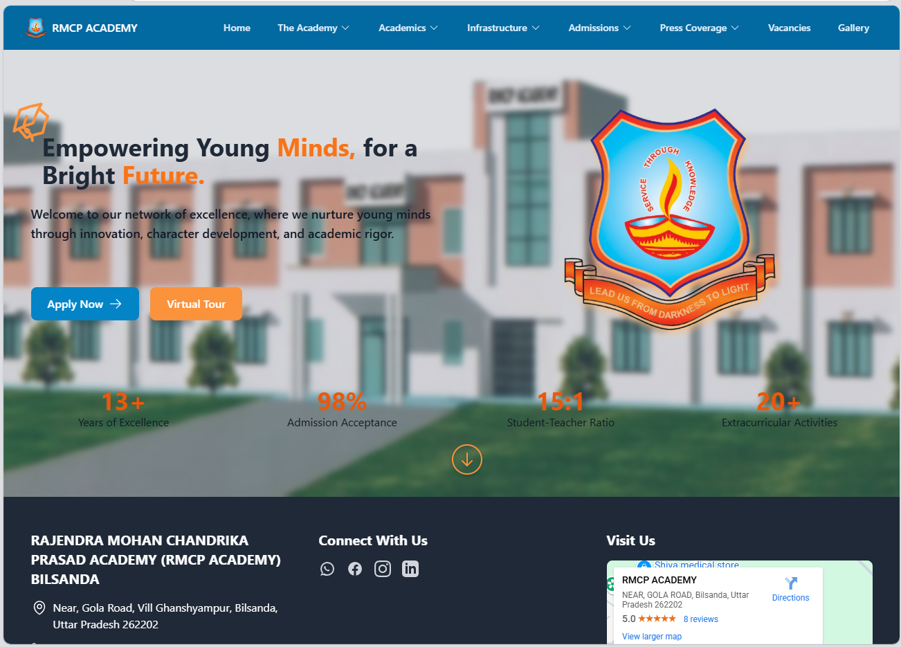
**About Us**
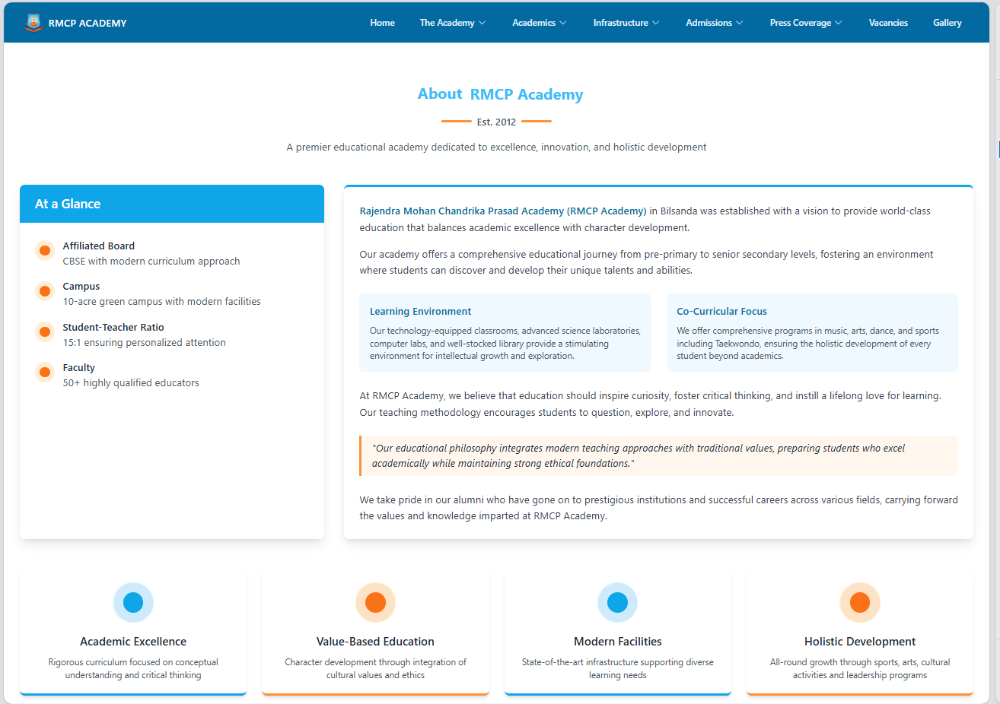
**Press Coverage**
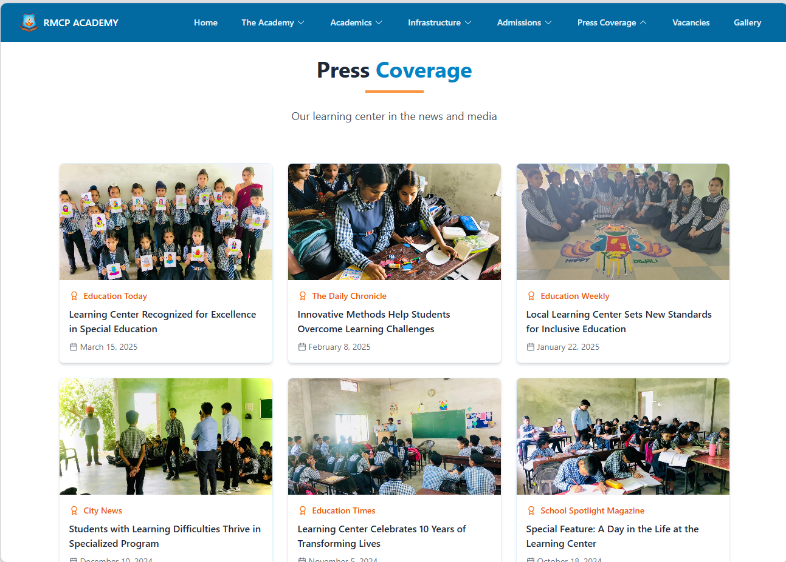
**E-Magazines**
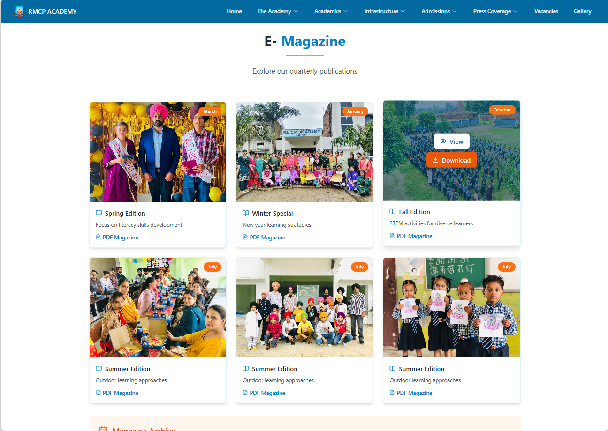
**Academics**
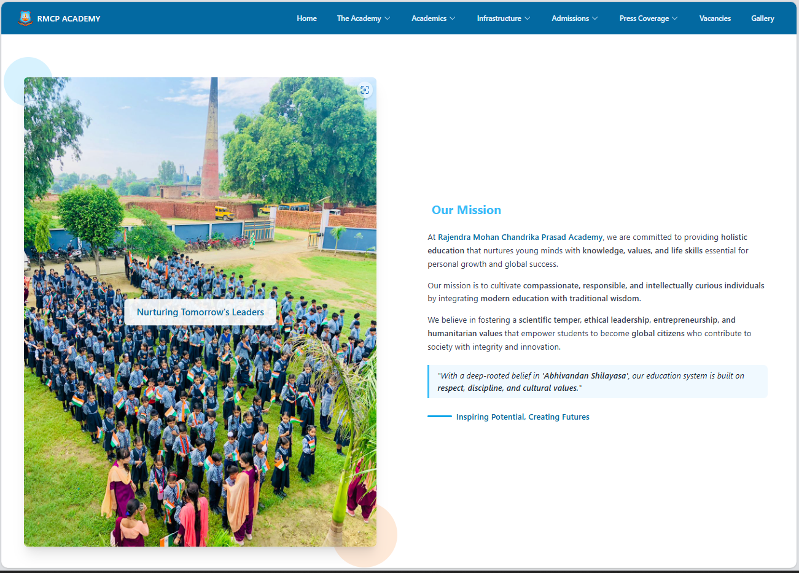
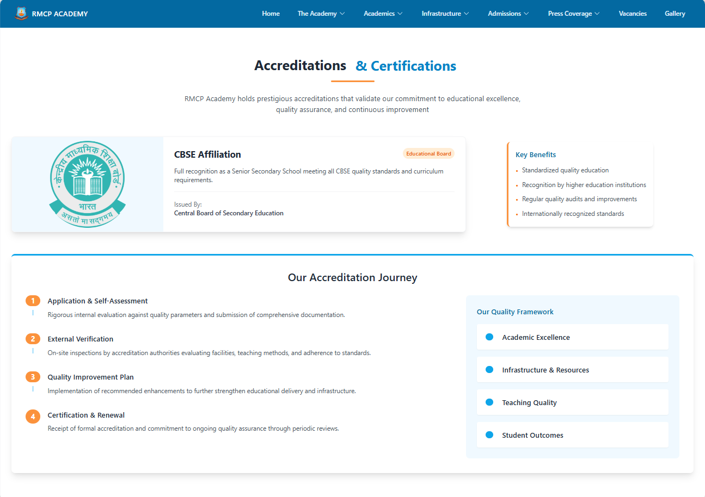
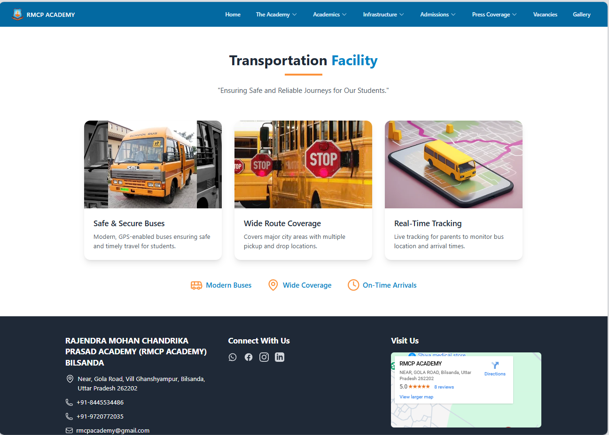
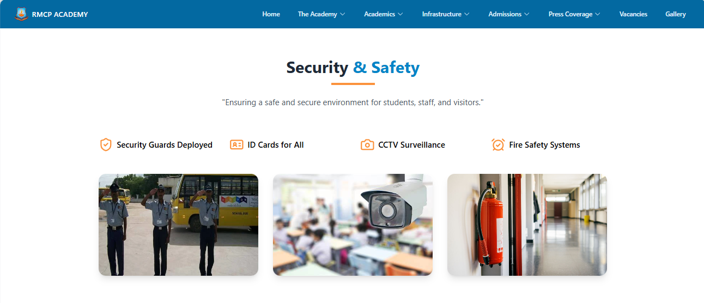
**Events**
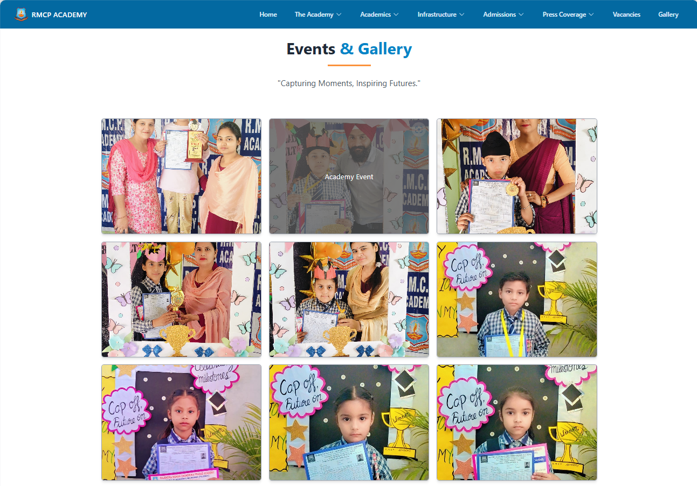
**Admin panel**
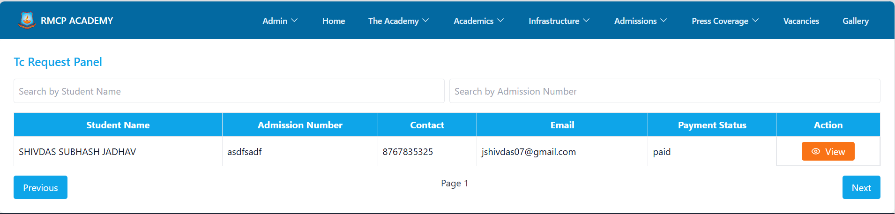 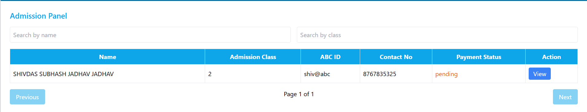  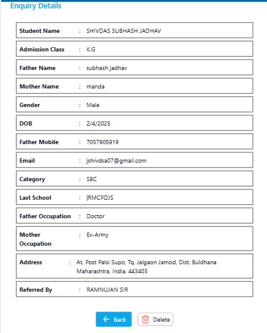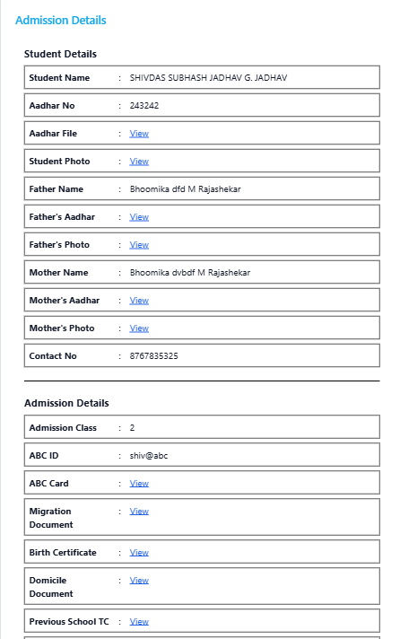 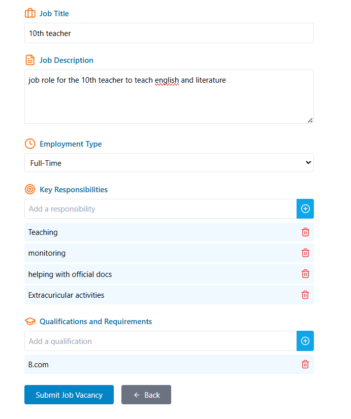
